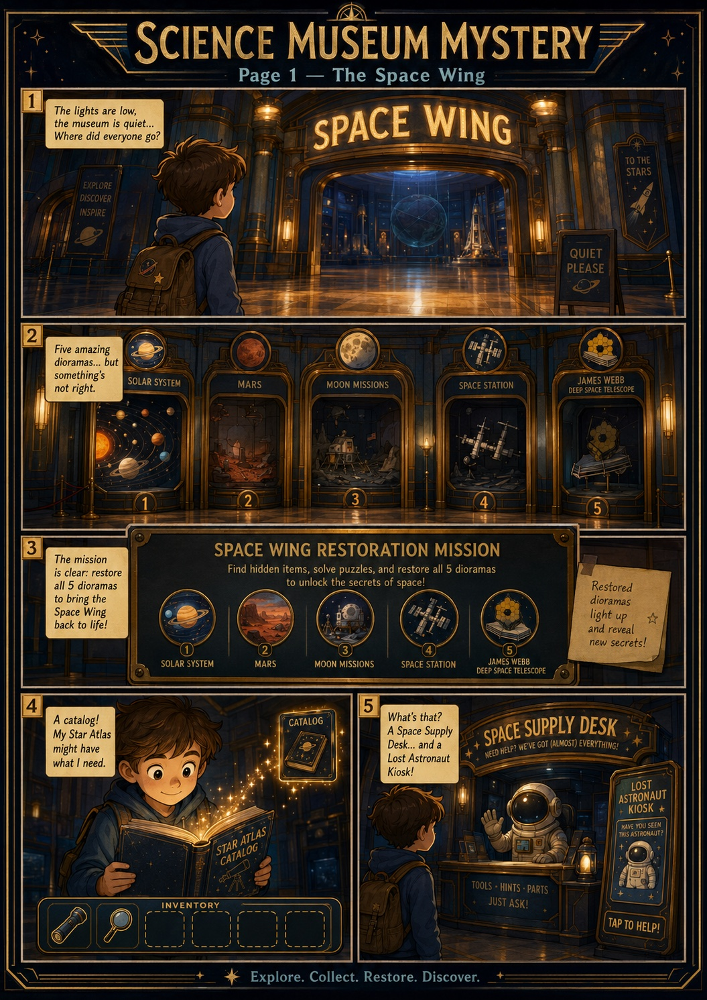
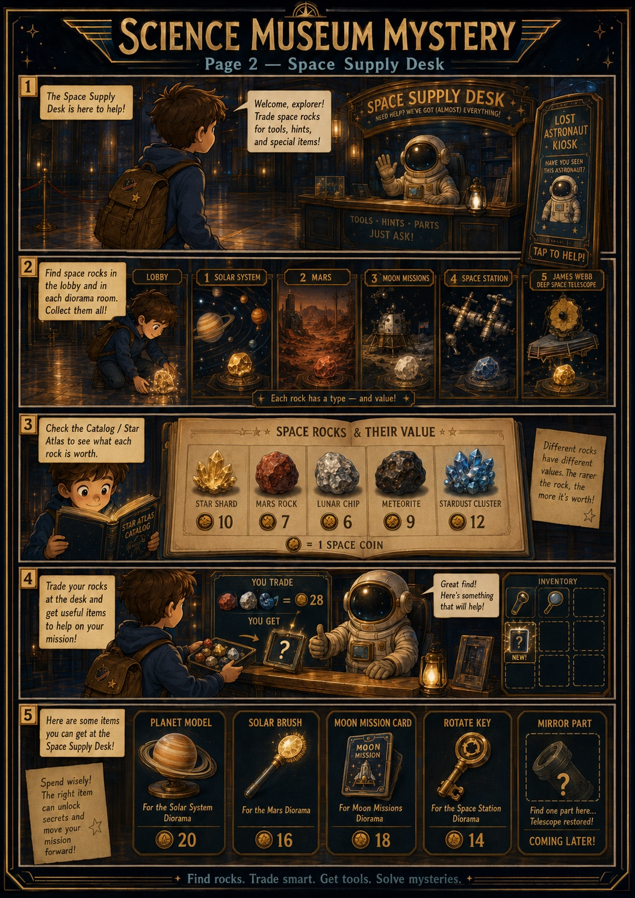
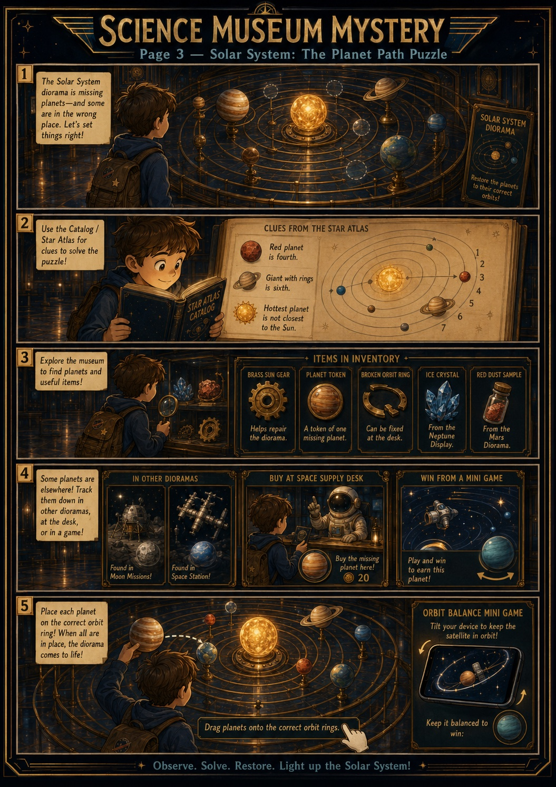
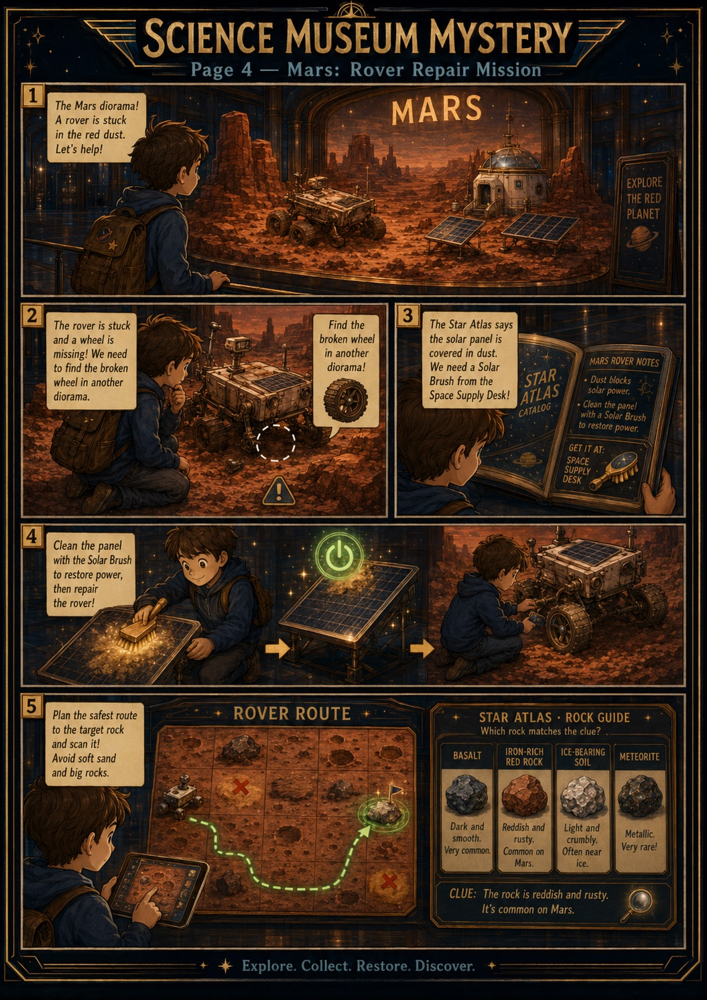
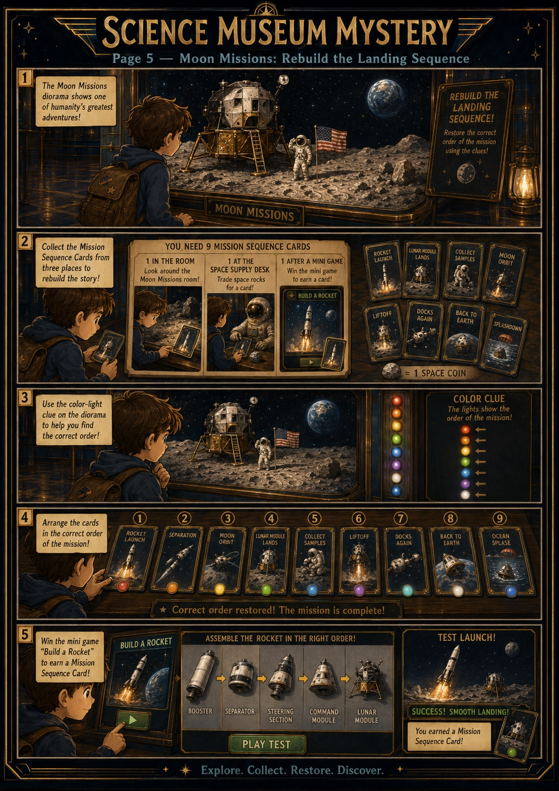
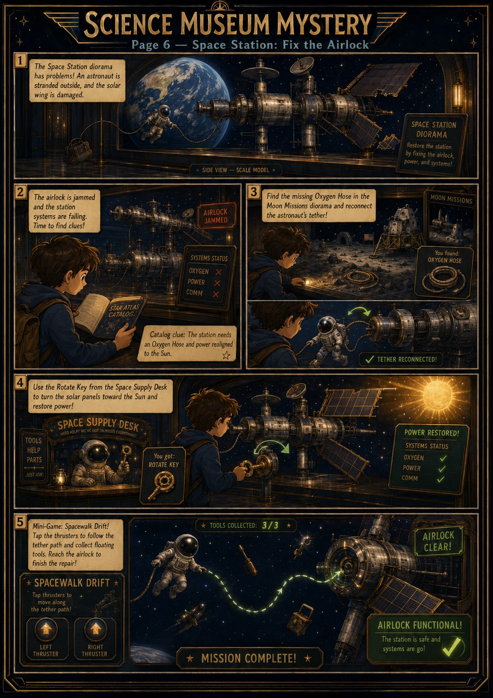
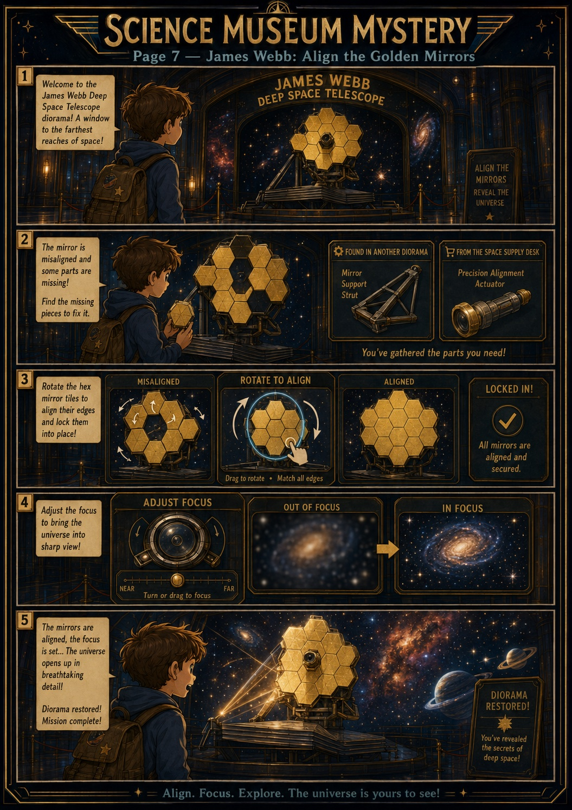
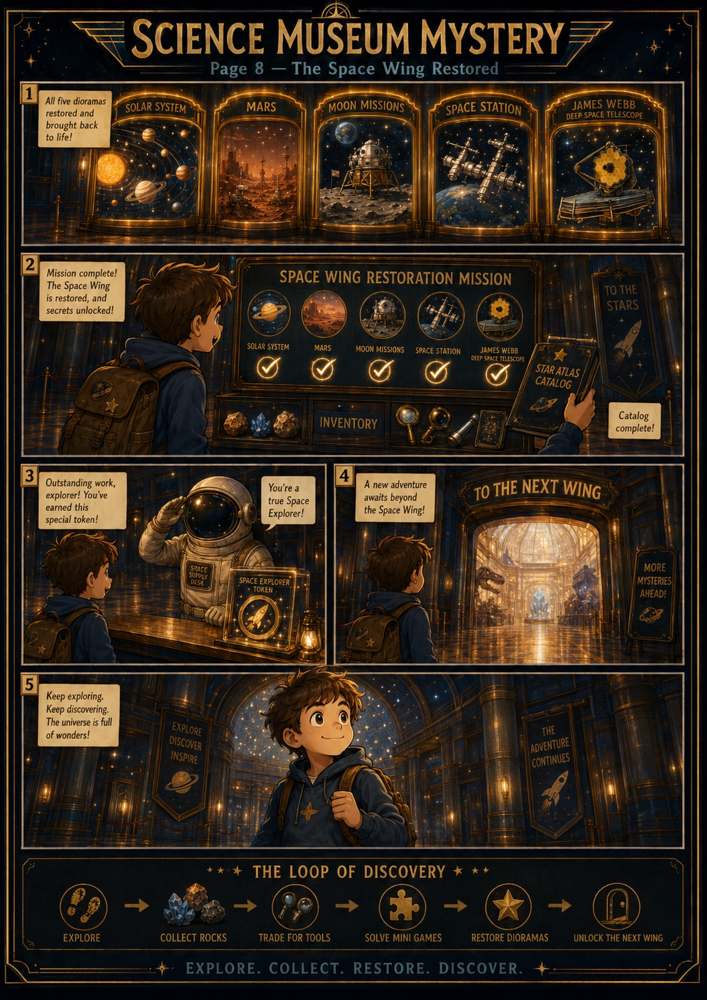

# Space Wing — spec + build plan (ready to execute)

The **second wing** of [[game-concepts]] (Science Museum Mystery). Same core loop as
the Dinosaur Wing ([[prototype-parallax-first-slice]]) — **fix/restore 5 dioramas to
progress** — but a different feel, and it introduces **three systems the dino wing never
had**. Gidi delivered the full design as an 8-page comic spec.

## The spec (8 pages, by Gidi)

1. **The Space Wing** — enter the dim Space Wing; 5 dioramas (Solar System, Mars, Moon
   Missions, Space Station, James Webb), each broken. Mission: restore all 5. Star Atlas
   catalog + inventory introduced; a **Space Supply Desk** and **Lost Astronaut Kiosk**
   appear.
2. **Space Supply Desk** — the economy hub. Find **space rocks** in the lobby + every
   room; each rock has a type and value (Star Shard 10, Mars Rock 7, Lunar Chip 6,
   Meteorite 9, Stardust Cluster 12 coins). Trade rocks for coins → buy tools (Planet
   Model 20, Solar Brush 16, Moon Mission Card 18, Rotate Key 14, Mirror Part — later).
3. **Solar System — Planet Path Puzzle** — place planets on correct orbit rings using
   Star Atlas clues (red planet is fourth; ringed giant is sixth; hottest planet isn't
   closest to the Sun). Planets are scattered: some in other dioramas, one **bought** at
   the desk, one **won** from the **Orbit Balance** tilt mini-game.
4. **Mars — Rover Repair** — find the missing rover wheel (in another diorama), buy a
   **Solar Brush** to clean the dust-covered panel (Star Atlas clue), repair the rover,
   then plan a safe route + scan the correct rock by matching its catalog traits
   (reddish/rusty = iron-rich red rock).
5. **Moon Missions — Rebuild the Landing Sequence** — collect 9 mission-sequence cards
   (in room, traded at desk, won from **Build-a-Rocket** mini-game); the diorama's
   **color-light cycle is the order clue**; arrange the cards in the correct sequence.
6. **Space Station — Fix the Airlock** — find the **oxygen hose** (in the Moon diorama)
   to reconnect the tether, use the **Rotate Key** (from the desk) to turn the solar
   panels to the Sun and restore power, then a **Spacewalk Drift** mini-game to reach the
   airlock (3/3 tools).
7. **James Webb — Align the Golden Mirrors** — gather a mirror support strut (another
   diorama) + a precision actuator (desk), **rotate the hex mirror tiles** to align edges,
   then **adjust focus** until the galaxy sharpens; the universe opens up.
8. **The Space Wing Restored** — all 5 checked off, catalog complete, Space Explorer
   Token awarded, doorway to the next wing. Reinforces the loop: Explore → Collect Rocks
   → Trade for Tools → Solve Mini-Games → Restore Dioramas → Unlock the Next Wing.

### The full comic spec (Gidi, 8 pages)

## Three net-new systems (vs. the dino wing)

1. **Economy** — Space Supply Desk / Lost Astronaut Kiosk: find rocks → sell for coins →
   buy items needed to finish dioramas. Coins + a "Space Rocks" catalog index are new.
2. **Cross-room item dependencies** — items needed in one diorama are hidden in *others*,
   so exploration across rooms gates completion (no room solvable on first visit; no
   deadlocks).
3. **New puzzle types** — multi-slot ordered placement (Planet Path), a card-sequence
   puzzle (Moon landing), a re-readable **Star Atlas with textual clues/riddles**, plus
   **5 new mini-games** (Orbit Balance, Rover Route, Build-a-Rocket, Spacewalk Drift,
   Focus the Stars).

Holds to the six [[gameplay-principles]] and [[art-direction]] / [[scientific-realism-rule]]
(real spacecraft + true planet order / Apollo sequence — verify space facts in the catalog
data; there's no space equivalent of the `paleontologist` skill yet).

## Build plan — READY ✅

Detailed, ready-to-execute plan:
`product/prototypes/museum-parallax/SPACE-WING-PLAN.md`. It maps every page to the existing
engine: reuses the dino wing's scene/world model, inventory, catalog, drag/rotate, mini-game
contract, tilt input, and completion/finale — and lists exactly which files change. Scope
decided with Gidi: **full playable wing** (all 5 dioramas interactive, all 5 mini-games real,
full sell+buy economy), **wireframe SVG art now**, painted layers drop in 1:1 later (team norm).

## Status / approvals

- **Plan:** in build (started 2026-07-22).
- **Gidi (product):** ✅ approved starting execution (2026-06-16), and on 2026-07-22
  waived the wait for Dor's sign-off — build proceeds, design feedback folds in as
  it comes.
- **Ohad (tech):** FYI — second wing generalizes the single-wing engine; no blocker.

## Build progress (2026-07-22)

- ✅ **Wing engine generalized** — a `WINGS` registry drives navigation, seals and
  finales; rooms declare their own challenges. The dino wing is behaviour-identical.
- ✅ **[[astronomer]] skill + [[space-accuracy-rulings]]** — space content has the
  same accuracy guard the dino wing has. Caught the "oxygen hose" error before build.
- ✅ **Economy + Supply Desk** — see [[space-economy-design]], including the
  two-pouch bag (Finds / Rocks).
- ✅ **Space Hall hub + the lobby door** — the SPACE door is no longer roped off.
  The hall has five framed niches (Solar System / Mars / Moon / Station / Webb),
  the Supply Desk counter, and a space rock on the floor, so the whole
  find → sell → buy loop is learnable within sight of the desk that pays for it.
  Unbuilt dioramas say they're being installed rather than failing silently.
- ✅ **Room 1 — Solar System (the Planet Path puzzle)** + its mini-game, **Orbit
  Balance**. The orrery has eight numbered rings; three are empty (2, 4, 6) and the
  Star Atlas describes exactly those three **by trait, never by name**. The three
  missing planets come from **three different sources** — Mars found by exploring
  the room, Saturn bought at the Supply Desk, Venus won in Orbit Balance — so the
  wing's whole loop is taught inside one exhibit.
- ✅ **Room 2 — Mars (Rover Repair)** + its mini-game, **Rover Route**. Two repairs
  gate the drive: the rover's **wheel is hidden in the Solar System room** (the wing's
  first real cross-room dependency — you cannot finish Mars from inside Mars) and its
  solar panel is cleaned with the **Solar Brush** bought at the desk. Only then does
  the drive console light up. In Rover Route you plan the whole path first and then
  drive it — which is how real rovers work, because commands take minutes to arrive —
  and the actual question is which of three rocks is the **iron-rich red** one.
- ✅ **Room 3 — Moon Missions (the Landing Sequence)** + its mini-game,
  **Build-a-Rocket**. Two halves: **gather** six mission cards from four different
  places (three in the room, one over in the Mars bay, one sold at the desk, one won
  by stacking a Saturn V correctly), then **order** them the way Apollo 11 actually
  went. CHECK locks the cards already in the right place and hands the rest back, so
  it converges without being trivial. Michael Collins stays in orbit throughout —
  "all three walked on the Moon" is the commonest Apollo mistake in kids' media.
- ✅ **Room 4 — Space Station (Fix the Airlock)** + its mini-game, **Spacewalk
  Drift**. Two repairs of different kinds: clip the **safety tether** back on (it's
  over in the Moon room) and use the **Rotate Key** from the desk to turn the solar
  array to face the Sun — which is drawn in the scene, so the room answers its own
  question. Then a tethered spacewalk to recover three floating tools; the hatch
  stays locked until all three are aboard.
  **The spec's "oxygen hose" is now a safety tether** (Gidi approved, 2026-07-22):
  a spacewalker's air comes from the suit's own backpack, never a line to the ship.
  Item and puzzle unchanged; the fact corrected, and the catalog says so explicitly.
- ✅ **Room 5 — James Webb (Align the Golden Mirrors)** + its mini-game, **Focus the
  Stars**. Three challenges deep: fit the support **strut** (from the Space Station)
  and the missing **18th segment** (desk), then tap the seven crooked segments until
  every notch points the same way — the eleven already-correct ones are the
  reference, so no separate instructions are needed. Then Focus the Stars: eighteen
  segments make eighteen images of one star, and you drag them into a single point,
  which is what Webb's real commissioning looked like.
- ✅ **THE WING IS COMPLETE.** Finishing all five rooms fires the Space Wing finale,
  stamps the SPACE door in the lobby, and leaves the Dinosaur Wing untouched.

## Spec items closed after the first pass (2026-07-22)
- **Space Rocks catalog index** (plan §B) — the rock types and their coin values now
  have a catalog section, generated from the Supply Desk's own price list so the two
  can never disagree.
- **Space Explorer Token** (spec p.8) — awarded on wing completion, shown on the
  finale card, kept in the bag, and not sellable. The mechanism is per-wing
  (`WINGS[id].finale.token`), so the Dinosaur Wing can be given one whenever we want.

### Still open from the spec
- **Lost Astronaut Kiosk** (spec p.1) — never designed past the name; the Supply Desk
  currently does everything the economy needs. Needs a purpose before it needs code.
- **Doorway to the next wing** (spec p.8) — waiting on the Inventions wing existing.
- **The Moon room's colour-light cycle as the order clue** (spec p.5) — deliberately
  replaced by the Star Atlas: colour-matching would teach colours, not the Apollo
  sequence. Could return as an optional hint.

## The cross-room dependency graph (final)
Every room feeds the next, so none is a place you visit once:
**solar** hides Mars's rover wheel → **mars** hides a Moon mission card →
**moon** hides the Station's safety tether → **station** hides Webb's mirror strut.
The Supply Desk supplies the other half of each room (planet model, solar brush,
mission card, rotate key, mirror segment), so exploring and trading are both
required — neither alone finishes anything.

Regression-tested end to end by `npm run verify` in the prototype (**225 checks**
across eight suites: `verify-wings`, `verify-economy`, `verify-spacewing`,
`verify-solar`, `verify-mars`, `verify-moon`, `verify-station`, `verify-webb`).

### Design notes worth keeping
- **Countability beat realism in the orrery.** The first version fanned the planets
  around the ellipse the way a real orrery does — and it was unusable: you could not
  tell which planet sat on which ring, so "fourth from the Sun" became a guess. Every
  planet now mounts at the same point of its ring, in a straight row, with the ring
  number on a plate directly below. A five-year-old can literally count to four.
- **The difficulty lives in the reasoning, not the fingers.** Sockets are big and
  obvious; what's hard is knowing *which* planet belongs in one. Precise dragging is
  the thing young hands are worst at.
- **A wrong ring costs nothing** — it says why, hands the planet back, and changes
  nothing. No fail state, per [[gameplay-principles]] #4.
- **Tap-then-tap beats drag** for ordering puzzles (Landing Sequence, Build-a-Rocket).
  Young hands are much better at two taps than at a precise drag, and both puzzles are
  meant to be hard in the head, not in the fingers.
- **Write the test so it can actually fail.** The spacewalk's "the tether never lets
  you drift away" check first passed while the astronaut never moved at all — it
  proved nothing. Rewritten to hold the thruster for real, it immediately caught a
  sign error that made the tether push the astronaut *outward* instead of reeling
  them in; only a hard clamp had been hiding it.
- **Wrong answers are made informative, not punishing.** The sequence board locks the
  cards already right; a badly stacked rocket topples over rather than showing an
  error; a wrongly scanned Mars rock says what it actually is. Each is a fact learned,
  and none costs progress.

If the team treats "two-wing structure + economy" as architectural, promote to an ADR via
`/decide`. Related: [[prototype-parallax-first-slice]], [[game-concepts]],
[[gameplay-principles]], [[art-direction]], [[prototype-completion-states]], [[north-star]].
