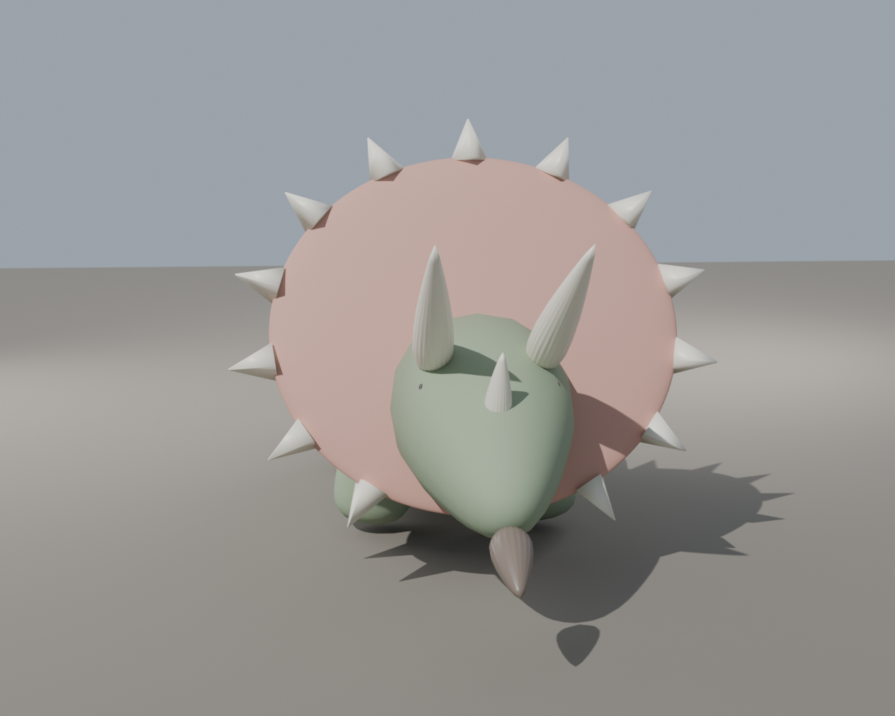
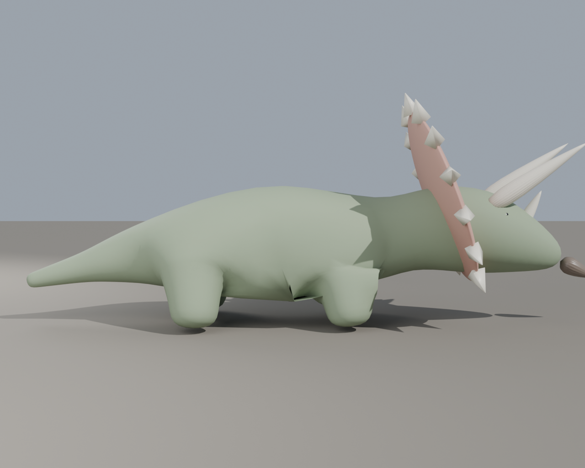

# 🗞️ FLOP WATCH: The Blender-Bot Builds a Triceratops, Gets a Balloon Animal

**MALABI HQ, June 15** — In the ongoing hunt for an **asset pipeline that doesn't
cost money** (see [[budget-constraint]]), Dor pointed Blender at a simple brief —
*"make me a Triceratops"* — and hit render. The machine obliged. The result did not.

**Head-on,** our would-be tyrant of the Cretaceous is a **pink party balloon** with
two confused horns poking out and a tiny snout. **In profile,** it's a serene
**hornless aardvark** that wandered in from a different museum entirely. Two views,
two different animals, zero Triceratopses.

It's a flop — and a *good* one. We document those.

## What was tried

A first stab at **auto-generating 3D game assets directly from Blender** (geometry
+ a quick clay render, two camera angles) instead of hand-modeling or paying a
hosted image API. The dream: type a creature, get a usable model. This run produced
`triceratops.blend` plus front/side renders in `product/assets/blender/`.

## Why it flopped

- **No anatomy reference fed in.** The generator guessed silhouette from the name
  alone — so the frill became a sphere and the body a featureless bean.
- **Front and side don't agree.** The two renders describe different creatures,
  which means there's no coherent 3D form underneath — a non-starter for a real asset.
- **Off our bar.** It badly misses both [[art-direction]] (warm, painterly museum)
  and [[scientific-realism-rule]] / [[dino-accuracy-rulings]] (a Triceratops has
  three horns and a *scaly*, real silhouette — not a balloon).

## Why we're keeping it

The team's standing pattern is to **document failures cheerfully** — the Great
Monkey Incident ([[daily-dispatch-2026-06-12]]) is the precedent. A logged flop is
a saved hour for the next person who reaches for "just let Blender do it."

## Lessons logged

- **Reference-in or it's noise.** Procedural/auto geometry needs real anatomy
  guidance (silhouette, proportions, horn/frill placement) before it's worth a render.
- **Multi-view consistency is the bar.** If front and side disagree, there's no
  asset — only two unrelated pictures.
- **Both headless-Blender approaches hit the same wall.** Blender runs fully
  scriptable (`--background --python`), and we tried two routes: *parts-based
  procedural* (skin-modifier skeleton + modeled frill/horns) and *reference-trace →
  inflate* (silhouette of a side image, inflated by distance-from-outline). The
  trace gives a silhouette-perfect **side**, but a single side reference inflates
  **symmetrically into a lump** — the front/width is undefined without a true
  multi-view carve or hand sculpting. So the headless path doesn't escape the
  multi-view bar above; it just reaches it faster. (Files dropped 2026-06-16 — the
  experiment is the lesson, not the artifacts.)
- This nudges us back toward the decided direction: the **manifest-driven pipeline
  with a paid hosted image API** is still the path (see
  [0004](../../decisions/0004-drop-local-comfyui-engine.md)); free-local-Blender
  joins free-local-ComfyUI on the "tried it, off-target" shelf.

**Team call (2026-06-16, from Letters to the Editor):** we are **not** treating asset
generation as something to do at scale or automatically. Gidi and Dor agree these
auto-gen runs are **exploration only**, and the results **aren't good enough**. We're
fine **spending money for a great visual result** — a paid hosted image API or
commissioned art — over chasing a free auto-pipeline. Consistent with
[0004](../../decisions/0004-drop-local-comfyui-engine.md): a great visual result beats
a zero-cost generator we have to fight.

**Verdict:** 🎈 *Adorable. Not a Triceratops.* Filed, laughed at, moved on.

---

### The evidence

Front view — the balloon:

Side view — the aardvark:

Source files: `product/assets/blender/triceratops.blend` + `triceratops_front.png` /
`triceratops_side.png`.
